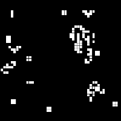

  

# Conway's Game of Life - made with RayLib in C  
My first GOF. o(*￣︶￣*)o  

## Controls:  
🖱️  
LMB - Draw cells  
RMB - Move camera  
MMB - Reset camera position  
⌨️  
-/= - Speed control  

TODO: make the grid infinite  
    add rows and columns if needed, and remove if no cell is alive.  
